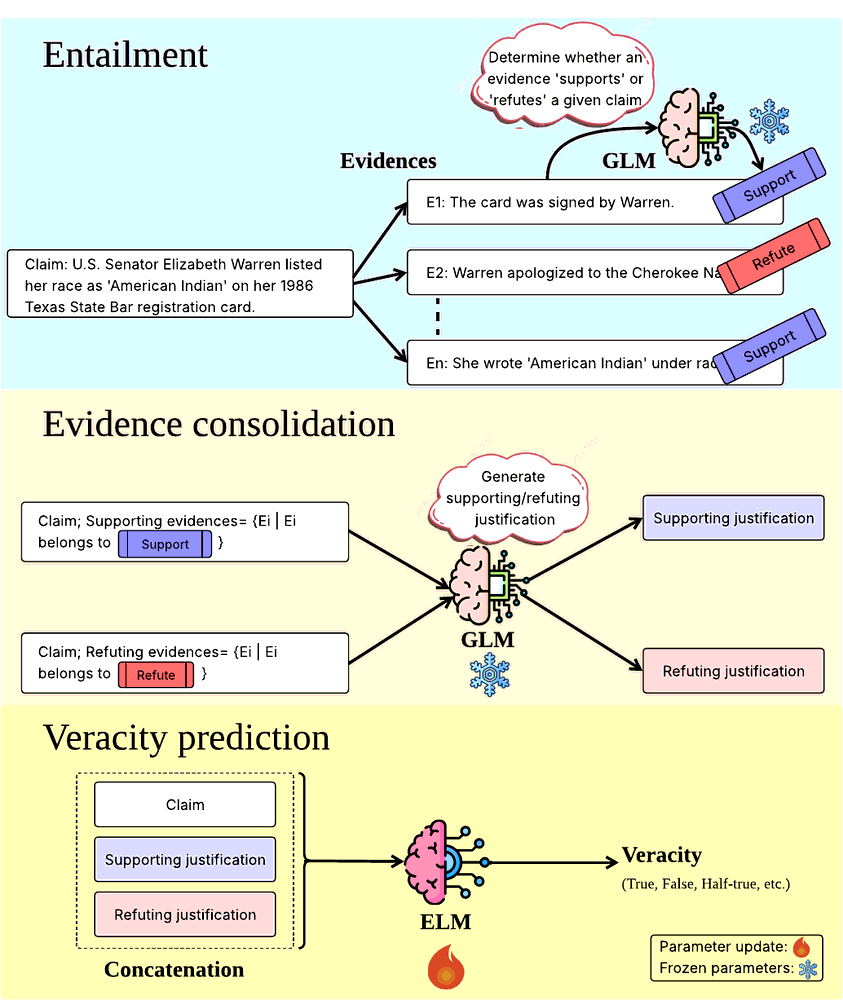
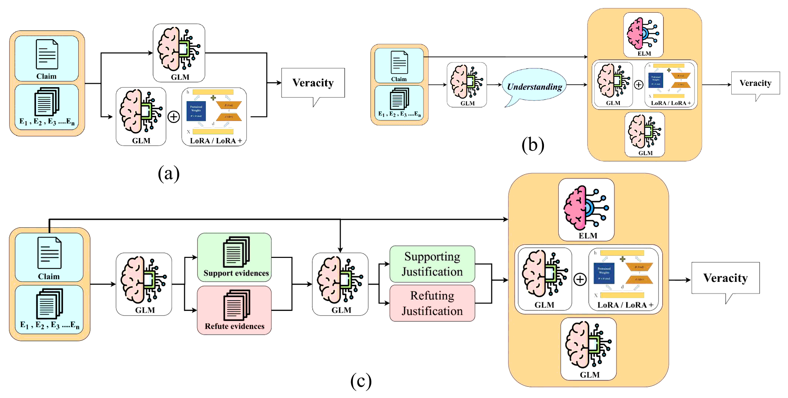

<h1 align="center">Entailed Opinion Matters</h1>

<p align="center">
  <b>Improving the Fact-Checking Performance of Language Models<br>by Relying on their Entailment Ability</b>
</p>

<p align="center">
  Gaurav Kumar · Ayush Garg · Debajyoti Mazumder · Aditya Kishore · Babu Kumar · Jasabanta Patro<br>
  <sub>Department of Data Science and Engineering, IISER Bhopal, India</sub>
</p>

<p align="center">
  <a href="https://arxiv.org/abs/2505.15050"></a>
  
  
  
  
</p>

---

## The idea in one picture

A claim's evidence set is usually **internally contradictory**, and one model asked to weigh
all of it at once gets confused. So don't ask it to. Split the job across the two model
families by what each is actually good at — a generative LM (GLM) *sorts* the evidence, an
encoder LM (ELM) *decides*.

<p align="center">
  
</p>

| | Stage | Model | What it does |
|:-:|---|---|---|
| **1** | Entailment | GLM | Labels **each** evidence sentence `SUPPORT` or `REFUTE` against the claim |
| **2** | Consolidation | GLM | Turns the two groups into one *supporting* and one *refuting* justification |
| **3** | Veracity prediction | ELM | Fine-tuned on `claim [SEP] support_just [SEP] refute_just` → veracity |

Entailment has been used for claim–evidence *matching* before. Using it as an explicit
**evidence-discrimination step whose output becomes training supervision** is what is new here.

## Results at a glance

Training an encoder on GLM-entailed justifications (**TBE-3**) against the strongest prior
baselines — HiSS, FactLLaMA, RAFTS, L-Defense:

| Dataset | Setting | Best baseline | **Ours (TBE-3)** | Gain |
|---|---|:-:|:-:|:-:|
| LIAR-RAW | 6-class, English | 0.42 | **0.54** | **+28.6%** |
| RAW-FC | 3-class, English | 0.61 | **0.88** | **+44.3%** |
| Factify-2 | multimodal | 0.57 | **0.78** | **+36.8%** |
| MOCHEG | multimodal | 0.37 | **0.57** | **+54.1%** |
| VERITE | multimodal | 0.47 | **0.64** | **+36.2%** |
| X-Fact | 25 languages | 0.42 | **0.46** | **+9.5%** |
| RU22Fact | 4 languages | 0.61 | **0.73** | **+19.7%** |

<sub>Macro-F1, averaged over three random seeds. Full tables and significance markers in
<a href="docs/RESULTS.md">docs/RESULTS.md</a>.</sub>

> **The most informative result is a negative one.** Feed the *same* justifications back to a
> GLM at inference time (IBE-4) and performance collapses — 0.11–0.14 on LIAR-RAW, the worst
> cells in the paper. The gain is not "better inputs". It comes from using entailed
> justifications as a **training signal** for an encoder.

## Seven experiments, three research questions

<p align="center">
  
</p>

| | R1 — raw evidence | R2 — overall understanding | R3 — entailed justifications |
|---|---|---|---|
| **Training-based** | TBE-1 | TBE-2 | **TBE-3 ← the method** |
| **Inference-based** | IBE-1 (zero-shot) | IBE-2 (2-step), IBE-3 (+CoT) | IBE-4 |

Five GLMs throughout — Mistral-7B, Llama-3.1-8B, Gemma-7B, Qwen2.5-7B, Falcon3-7B — plus
three vision GLMs and two multilingual encoders for the generalisation study.

Ablation confirms both halves matter: removing the supporting justification costs
**&minus;31.5%** macro-F1, removing the refuting one **&minus;9.3%**, removing both **&minus;55.6%**.

---

## Repository layout

```
.
├── monolingual/       LIAR-RAW + RAW-FC          — TBE-1/2/3, IBE-1/2/3/4   (Tables 2-7)
├── multimodal/        Factify-2, MOCHEG, VERITE  — TBE-3 only               (Table 8)
├── multilingual/      X-Fact, RU22Fact           — TBE-3 only               (Table 9)
├── error_analysis/    explanation quality, attention, confusion matrices    (App. C, D; Fig. 3)
├── samples/           20-record slices of every stage, for smoke tests
├── env/               two pinned environments + LLaMA-Factory setup
├── docs/              dataset acquisition, pipeline↔paper map, results map
└── smoke_test.sh      verifies the repo without a GPU
```

`monolingual/` is the original LIAR-RAW / RAW-FC codebase, kept structurally
as-is; see [docs/CHANGES.md](docs/CHANGES.md) for the short list of edits made to it.

---

## Quick start

```bash
git clone <this-repo> && cd Entailment-Based-Fact-Checking

# 1. verify the checkout (no GPU, no model downloads, ~30 s)
bash smoke_test.sh

# 2. build the environments (see the warning below)
bash env/setup.sh both

# 3. end-to-end on 5 claims, to confirm the GPU path works
conda activate entail-vllm
bash smoke_test.sh --gpu
```

### ⚠ Two environments are required

vLLM and LLaMA-Factory have conflicting `transformers` pins and **cannot** share an
environment:

| Environment | Pin | Used for |
|---|---|---|
| `entail-vllm` | `vllm 0.11.0`, `transformers 4.57.0`, `torch 2.8.0` | steps 1–2 (evidence classification, justification generation), ELM training, adapter inference |
| `entail-llamafactory` | `transformers <= 4.49` | LoRA / LoRA+ / QLoRA **training** of the GLMs |

`env/requirements-vllm-freeze.txt` is the exact `pip freeze` of the environment the paper's
numbers were produced in; use it if you need bit-exact reproduction.

All experiments were run on a single **NVIDIA A100 80GB**.

### System prerequisite: Python development headers

vLLM compiles Triton kernels at startup, which needs `Python.h`. Without it every step-1 /
step-2 run dies with

```
fatal error: Python.h: No such file or directory
...
torch._dynamo.exc.BackendCompilerFailed: backend='VllmBackend' raised:
CalledProcessError: Command '['/usr/bin/gcc', ... '-I/usr/include/python3.10']' returned non-zero exit status 1
```

Install the headers matching your interpreter:

```bash
sudo apt-get install -y python3-dev build-essential   # or python3.11-dev, etc.
```

If you cannot install packages, fall back to the non-compiling engine — slower, but it runs:

```bash
export VLLM_USE_V1=0
```

---

## Running the pipeline

Each section is a numbered chain; run the steps in order. The commands below use LIAR-RAW,
Factify-2 and X-Fact as examples — the sibling datasets follow the same shape and are
documented in each section's own README.

### Monolingual — LIAR-RAW / RAW-FC

```bash
conda activate entail-vllm
cd monolingual/TBE3/lair_raw

# step 1 — entailment: classify each evidence sentence SUPPORT / REFUTE
python lair_raw_evidences_classification.py --data_dir ./first_step_data_lair_raw

# step 2 — consolidation: one supporting + one refuting justification per claim
python justification_generation.py

# step 3 — normalise the generated text
python cleaning_data.py --input_dir ./outputs --output_dir ./cleaned_data

# steps 4-5 — veracity prediction with an ELM
python roberta_large_lair_raw_tranning.py
python XLNET_large_lair_raw_tranning.py
```

Add `--limit 5` to step 1 for a quick smoke run. Use the `*_seed.py` training variants to
reproduce the three-seed averages reported in the paper.

For the GLM side (LoRA / LoRA+, Tables 3–5):

```bash
conda activate entail-llamafactory
cd monolingual/TBE3/LoRA_and_LoRA+_finetuning
bash LIAR_RAW_LoRA.sh          # and LIAR_RAW_LoRA++.sh / RAWFC_LoRA.sh / RAWFC_LoRA++.sh
```

`monolingual/TBE1/` and `monolingual/TBE2/` cover the raw-evidence and
claim-evidence-understanding ablations; `monolingual/IBE1-4/` cover the prompting baselines.
See [monolingual/README_PIPELINE.md](monolingual/README_PIPELINE.md).

### Multimodal — Factify-2 / MOCHEG / VERITE

```bash
conda activate entail-vllm
cd multimodal

# step 1 — VLM entailment over (claim+image, evidence+image)
python 1_evidence_classification/evidence_classification_unified.py \
    --data_path  /path/to/factify2/train.csv \
    --dataset_type factify --model_key qwen2vl \
    --output_json outputs/train_evidence_qwen2vl.json

# step 2 — supporting / refuting justifications
python 2_justification_generation/justification_generation_qwenvl_idefics3.py \
    --input_json  outputs/train_evidence_qwen2vl.json \
    --output_json outputs/train_justifications_qwen2vl.json --model_key qwen2vl
python 2_justification_generation/prepare_final_justifications.py

# step 3 — ELM (RoBERTa / XLNet / DeBERTa) with QLoRA
bash 3_train_elm/run_factify_roberta.sh

# step 4 — GLM (Llama-3.1-8B / Mistral-7B) with QLoRA
python 4_qlora_glm/prepare_data/to_llamafactory.py --dataset factify2 \
    --input outputs/train_justifications_qwen2vl_final_justification.json \
    --output train_llamafactory_qwen_factify.json
conda activate entail-llamafactory
llamafactory-cli train 4_qlora_glm/configs/factify2/qwen_data/llama3_lora_sft_bnb_npu_qwen_57.yaml
```

MOCHEG and VERITE keep their gold labels in the dataset's own corpus file; join them onto the
justifications first with `0_data_preparation/attach_labels.py`.

### Multilingual — X-Fact / RU22Fact

```bash
conda activate entail-vllm
cd multilingual

# step 0 — crawl claim URLs, chunk, retrieve the top claim-matching chunk
python 0_preprocessing/document_chunking.py
python 0_preprocessing/retriever.py          # FAISS + multilingual-e5-large-instruct

# steps 1-2 — entailment + consolidation (4-bit GLMs)
python 1_evidence_classification/evidence_classification.py
python 2_justification_generation/justification_generation.py

# step 3 — XLM-R / mBERT with QLoRA
bash 3_train_elm/slm_training_xfact_xlmr/train_xfact.sh

# step 4 — GLM with QLoRA, then inference
python 4_qlora_glm/prepare_data/to_llamafactory.py \
    --dataset_type xfact \
    --input_dir  data/justifications \
    --output_dir converted_datasets/xfact
conda activate entail-llamafactory
llamafactory-cli train 4_qlora_glm/configs/xfact/mistral_lora_sft.yaml
conda activate entail-vllm
bash 4_qlora_glm/run_inference.sh
```

---

## Datasets

Small and mid-sized artefacts are committed. The generated justifications — the expensive
part to reproduce — **are included for every dataset** so you can skip straight to step 3.

| Dataset | Classes | Split (tr/val/te) | Raw data | Justifications shipped |
|---|---|---|---|---|
| LIAR-RAW | 6 | 10,065 / 1,274 / 1,251 | committed | ✅ `monolingual/` |
| RAW-FC | 3 | 1,612 / 200 / 200 | committed | ✅ `monolingual/` |
| Factify-2 | 5 | 27,500 / 7,500 / 7,500 | **download** | ✅ `multimodal/data/justifications/factify2/` |
| MOCHEG | 3 | 11,669 / 1,490 / 2,442 | **download** | ✅ `multimodal/data/justifications/mocheg/` |
| VERITE | 3 | 811 / 101 / 102 | **download** | ✅ `multimodal/data/justifications/verite/` |
| X-Fact | 7 | 19,079 / 2,535 / 9,575 | **download** | ✅ `multilingual/data/justifications/xfact/` |
| RU22Fact | 3 | 11,217 / 1,600 / 3,216 | **download** | ✅ `multilingual/data/justifications/ru22fact/` |

Datasets marked **download** ship images or crawled web pages that are too large to commit.
[docs/DATASETS.md](docs/DATASETS.md) gives the source for each one and the exact directory it
must be placed in.

The repository is ~1.7 GB. No single file exceeds GitHub's 100 MB limit, so no Git LFS is
needed, but the first `git push` is large — push in a few commits rather than one.

---

## Models

Exactly as reported in Table 14 of the paper.

| Role | Models |
|---|---|
| ELM (mono/multimodal) | `roberta-large`, `xlnet-large-cased`, `microsoft/deberta-v3-large` |
| ELM (multilingual) | `xlm-roberta-large`, `bert-base-multilingual-cased` |
| GLM | `Mistral-7B-Instruct-v0.3`, `Llama-3.1-8B-Instruct`, `gemma-7b-it`, `Qwen2.5-7B-Instruct-1M`, `Falcon3-7B-Instruct` |
| GLM (4-bit, domain generalisation) | the `unsloth/*-bnb-4bit` builds of the above |
| Vision GLM | `Qwen2.5-VL-7B-Instruct`, `paligemma2-3b-pt-448`, `Idefics3-8B-Llama3-bnb_nf4` |
| Retrieval | `intfloat/multilingual-e5-large-instruct` + FAISS |

---

## Reproducing the paper's tables

[docs/RESULTS.md](docs/RESULTS.md) maps every table and figure to the script that produces it.

---

## Known gaps

Documented honestly rather than papered over — see [docs/CHANGES.md](docs/CHANGES.md) for the
full list. The two that affect interpretation:

1. **The gold label is present in the step-1 and step-2 prompts** for LIAR-RAW
   (`lair_raw_evidences_classification.py`, `justification_generation.py`), on the test split
   as well as train. RAW-FC's step 2 does not interpolate it, but its step 1 does.
2. **PaliGemma justification repair.** A helper in the MOCHEG working directory replaced ~60%
   of PaliGemma's degenerate generations with evidence pulled from Idefics3/Qwen2-VL. It is
   *not* wired into this pipeline and is not described in the paper; MOCHEG PaliGemma numbers
   should be read with that in mind.

---

## Citation

Accepted at AACL 2026. Until the proceedings are published, please cite the arXiv preprint:

```bibtex
@article{kumar2026entailed,
  title         = {Entailed Opinion Matters: Improving the Fact-Checking Performance of
                   Language Models by Relying on their Entailment Ability},
  author        = {Kumar, Gaurav and Garg, Ayush and Mazumder, Debajyoti and
                   Kishore, Aditya and Kumar, Babu and Patro, Jasabanta},
  journal       = {arXiv preprint arXiv:2505.15050},
  year          = {2026},
  eprint        = {2505.15050},
  archivePrefix = {arXiv},
  primaryClass  = {cs.CL},
  url           = {https://arxiv.org/abs/2505.15050}
}
```

This entry will be replaced with the ACL Anthology `@inproceedings` reference once the
proceedings are out.

## License

Code released under the MIT License (see `LICENSE`). The datasets keep their original
licenses; LIAR-RAW and RAW-FC are Apache 2.0.
